# 2주차(2022-03-15)
- 안드로이드스튜디오 설치 && 깃허브 가입 및 레포지토리 만듬
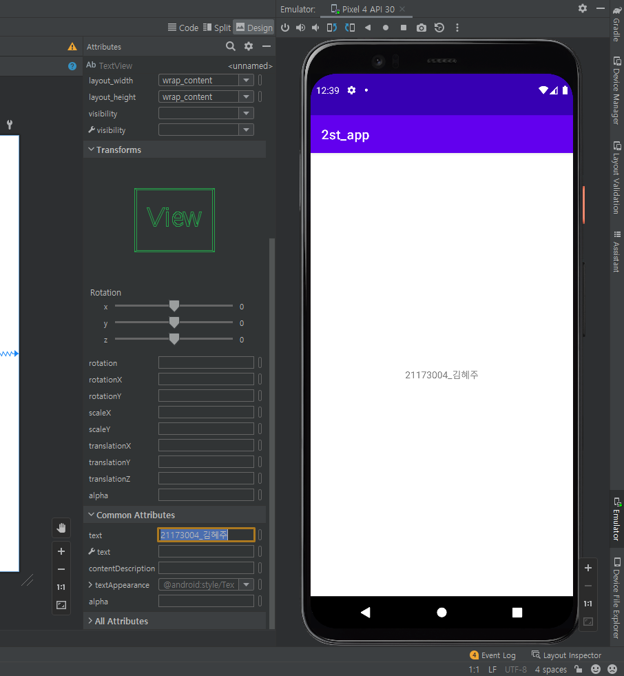</img>

# 3주차(2022-03-22)
- 전화걸기와 네이버

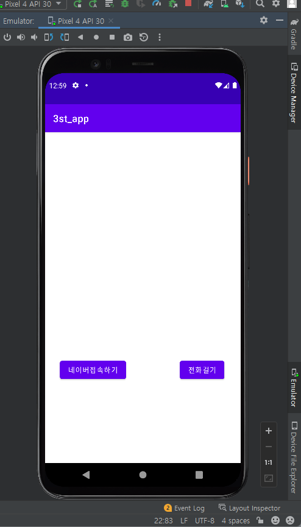</img>
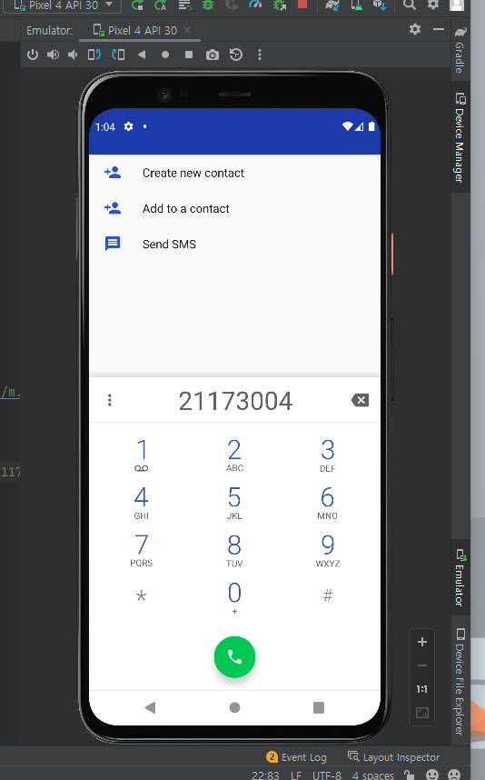</img>
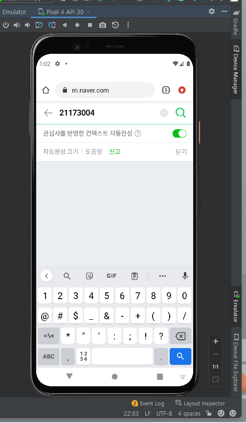</img>

# 4주차(2022-3-29)
-Toast 메세지 생성

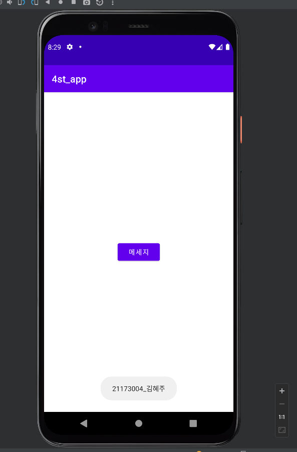</img>

# 5주차(2022-04-05)
- 이미지 생성

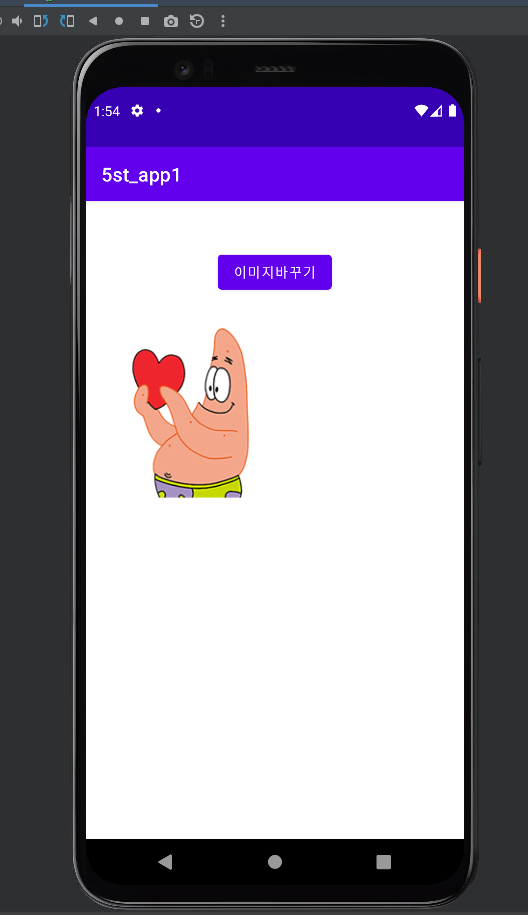</img>

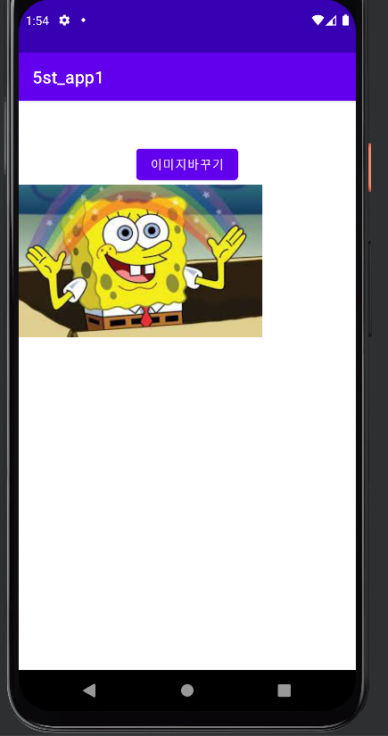</img>

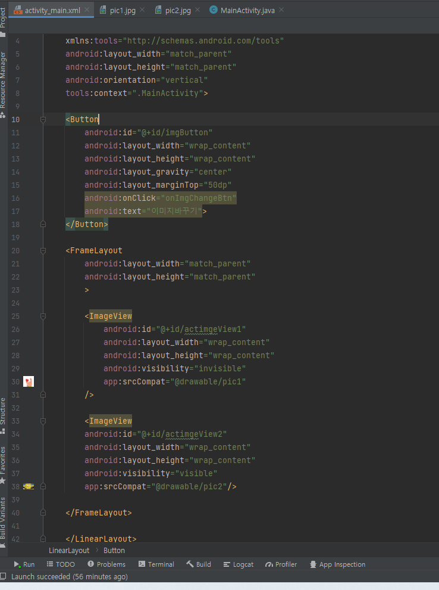</img>

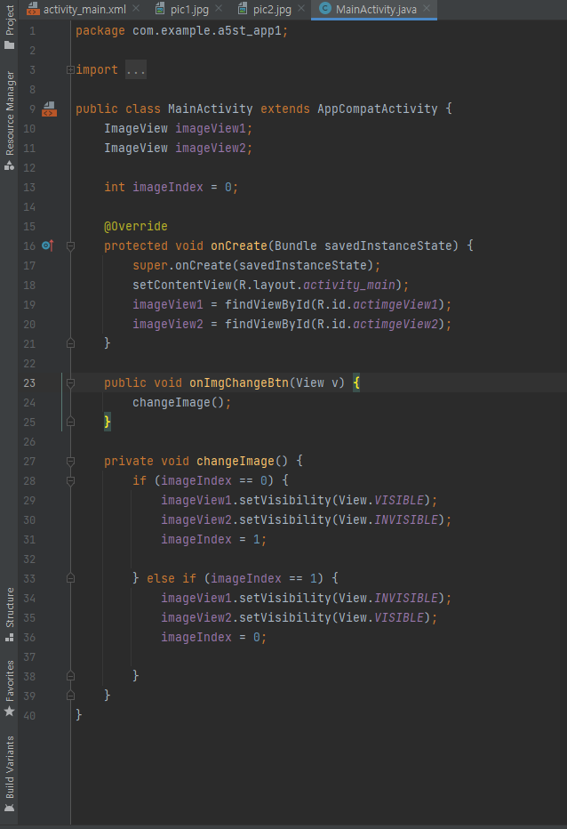</img>

# 6주차(2022-04-12)
-width와 height

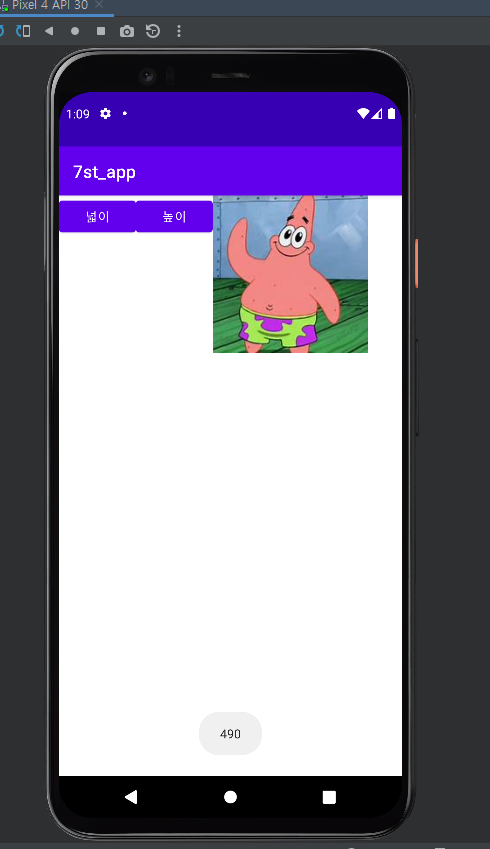</img>

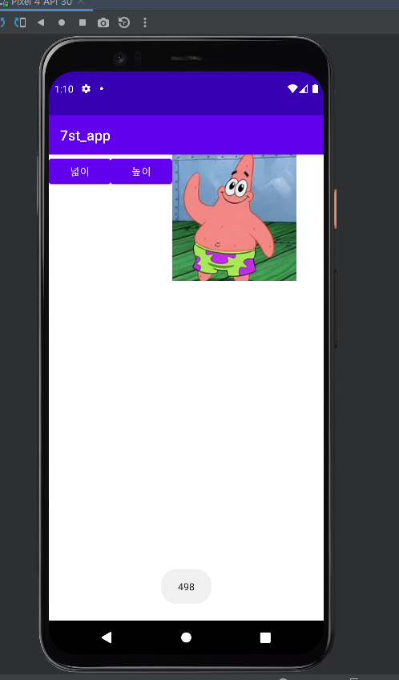</img>

# 10주차(2022-5-4)
-Main과 Menu

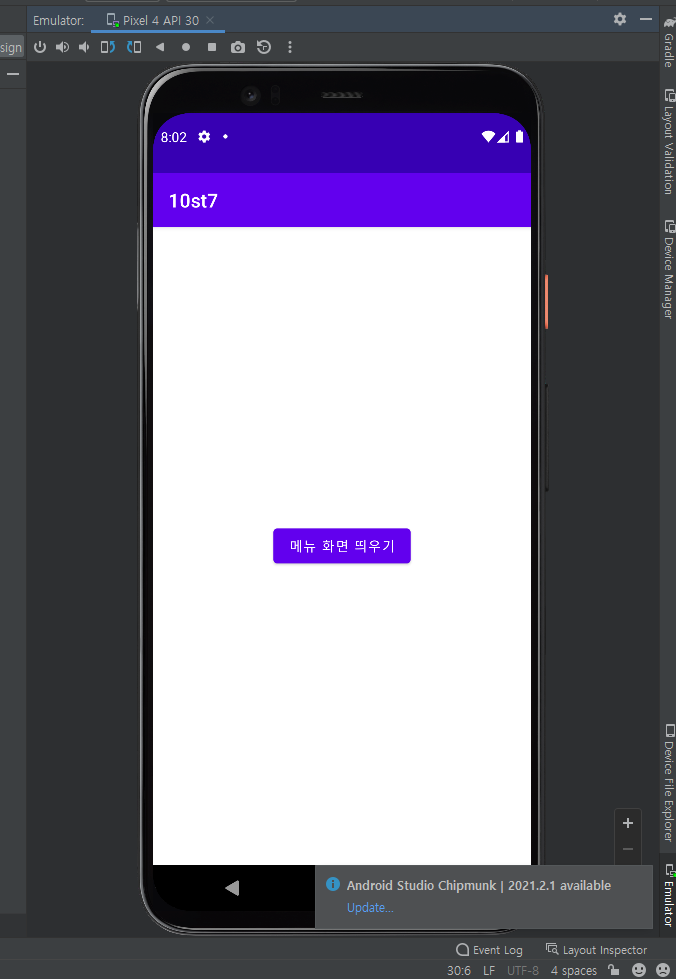</img>

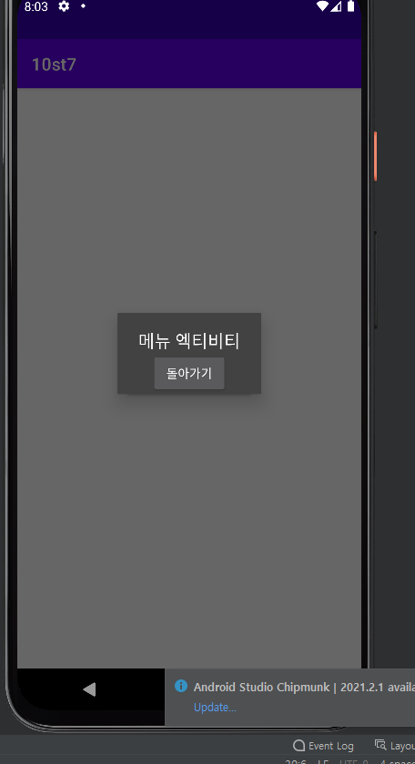</img>

